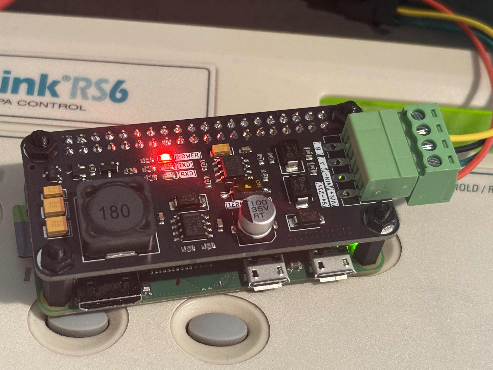
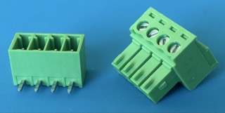
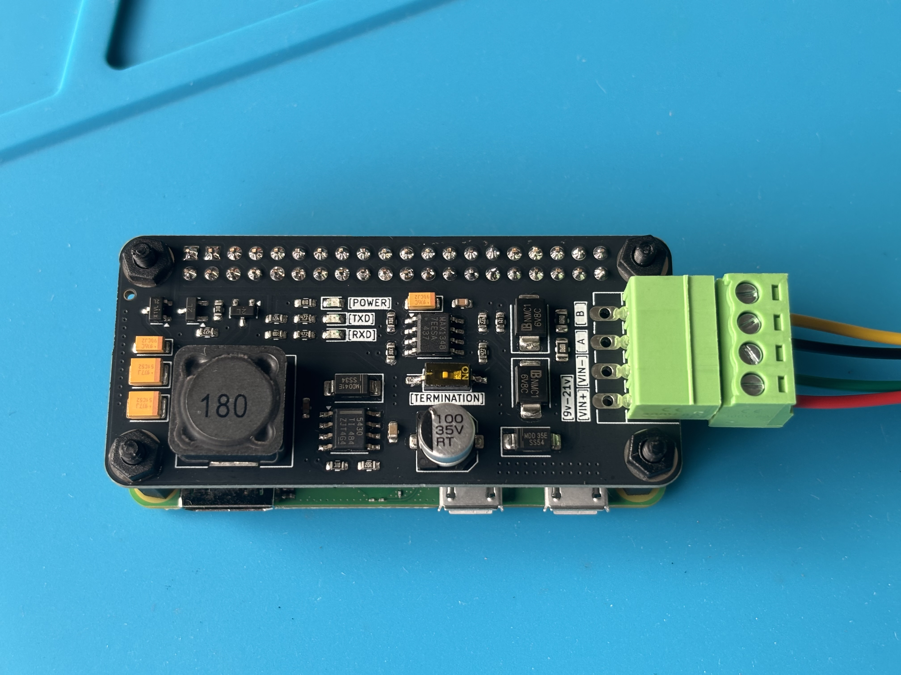
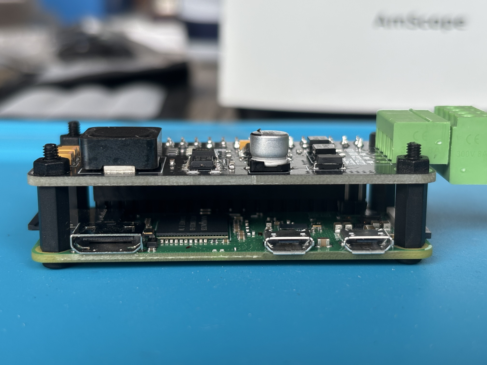
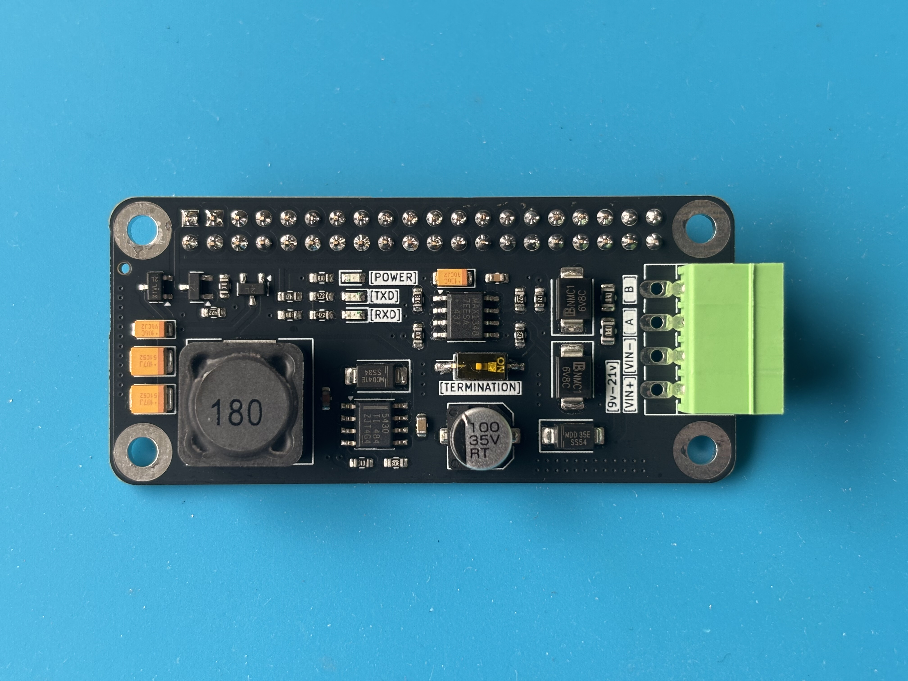
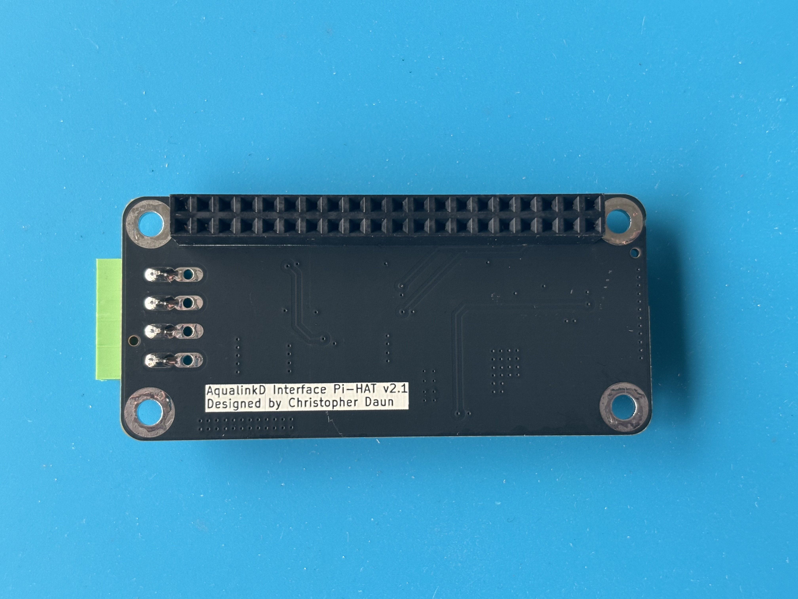

# AqualinkD Interface Pi-HAT

## What is it?

A Raspberry Pi HAT compatible with Raspberry Pi and similar SBCs
 
It is purpose built for use with [AqualinkD](https://github.com/sfeakes/AqualinkD) and allows you to easily connect an SBC to the Aqualink Serial bus

## Technical stuff

- Communication with the Pi happens over pins 8/10 for TX/RX
- If sourcing power from Aqualink's Serial bus, the board can provide 5v power up to 3 amps to power itself and the connected Pi (provided the Serial bus can deliver ~3 amps of current)
- The board has the same footprint as a Raspberry Pi Zero but also works on full size Pi boards like the Pi 3, 4, 5, etc. Usage with boards other then the Pi Zero form factor usually requre a different style connector for the Serial/Power connection. Vertical style connectors with a 3.50mm pin pith work.
- Two sets of 3.50mm mounting holes for the green Serial/Power connector allow for several connector options (horizontal flush/horizontal offset/vertical)

## Where can I get one?

1. Premade boards may available, reach out for more info
2. DIY - The files in the KiCAD/fabrication folder can be used without modification to have boards with all the surface mount components fabricated at [JLCPCB](https://jlcpcb.com/)

**Note for DIY #1**: Due to the way some components are oriented in jlcpcb's component reels, you may need to adjust the component rotation at the interactive board review stage when ordering. You may need to rotate the part at this point until the part's pin 1 designator lines up with the pin 1 designator on the board. This seems to be most common with the following components:

- U1 - Usually needs to be rotated 90 deg. clockwise
- Q1, Q2 and Q3 - Usually needs to be rotated 180 deg.
- J2 - This component is a switch and can be rotated 90 deg. either way if needed
- Use the image below for correct component orientations
  

**Note for DIY #2**: You'll need to source a 40pin GPIO female header and a 3.50mm 4 position screw terminal and solder them on to complete the board.

- [40pin GPIO female header - 2x20P 2.54mm pitch](https://a.aliexpress.com/_mOcIEMF)
   
  **^Link above is for a quantity of 10 connectors, double check the quantity and don't order more connectors then you need!**
   
  

- [4 position screw terminal - 3.50mm pitch vertical or right angle](https://a.aliexpress.com/_m0hhCc7)
   
  **^Link above is for a quantity of 5 connectors, double check the quantity and don't order more connectors then you need!**
   
  

## Software Setup

### Raspberry Pis running Raspbian

1. Run raspi-config with sudo: `sudo raspi-config`
2. Navigate to `Interface Options`
3. Navigate to `Serial Port`
4. Select `No` when asked if you would like a login shell to be accessible over serial **If you skip this step, aqualinkd will not work**
5. Select `Yes` when asked if you would like the serial port hardware enabled
6. Select `Ok`
7. Exit raspi-config
8. Reboot
9. Edit aqualinkd.conf with sudo: `sudo vim /etc/aqualinkd.conf`
10. Set the serial_port variable to use Serial0: `serial_port=/dev/ttyS0`

#### Troubleshooting:

1. You may need to adjust the rs485_frame_delay variable in /etc/aqualinkd.conf. This was not required for my setup but one user reported he needed to set: `rs485_frame_delay=10`

### Raspberry Pis running other OSs/Other Single Board Computers

Some SBCs like the [Orange Pi Zero 2W](http://www.orangepi.org/html/hardWare/computerAndMicrocontrollers/service-and-support/Orange-Pi-Zero-2W.html) and similar have the debug serial console enabled on GPIO pins 8/10 in their images. Serial communication will not work in this configuration and the debug serial console needs to be disabled. This is usually not trivial a varies by SBC so I won't provide guidance on how to do it here.

##

